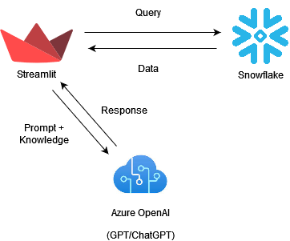
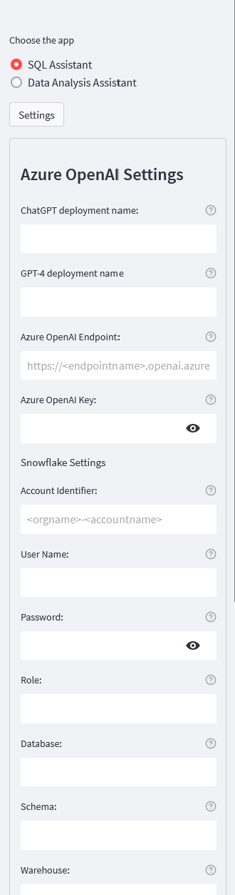
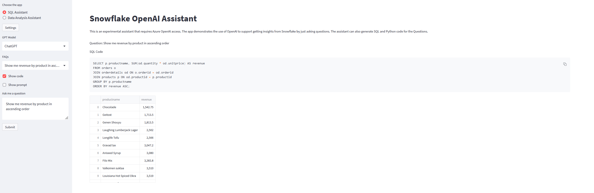
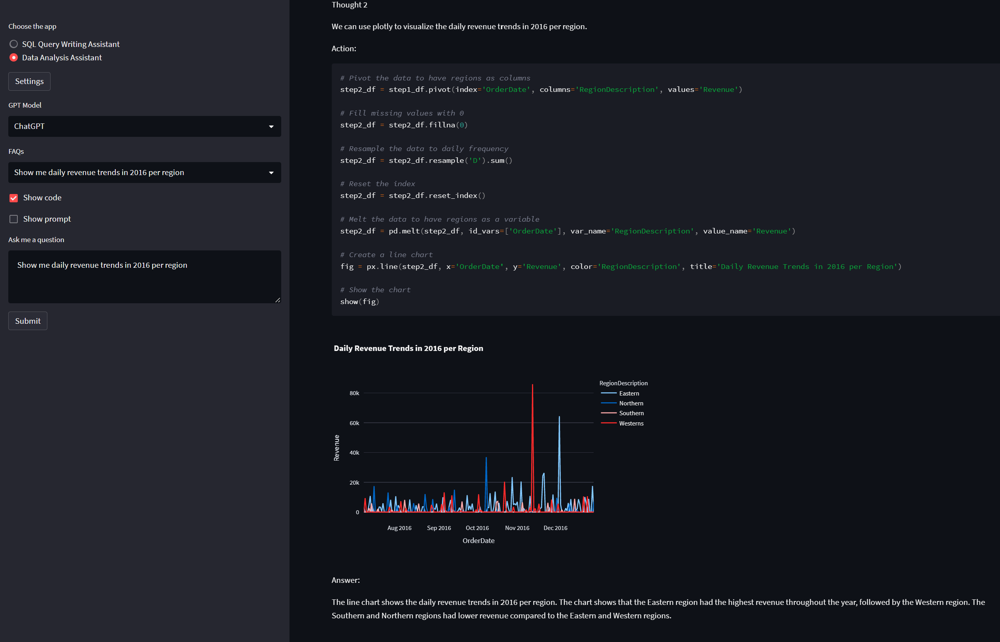
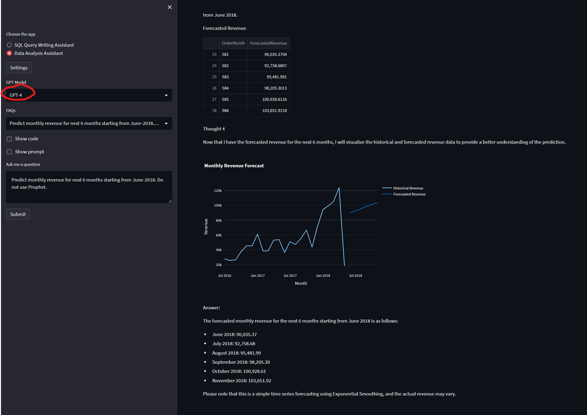

# Overview
This application demonstrates the of Open AI (ChatGPT/GPT-4) to help answer questions about data by performing advanced data analytic tasks on Snowflake Database.
Examples of questions are:
- Simple: Show me daily revenue trends in 2016 per region
- More difficult: Is that true that top 20% customers generate 80% revenue in 2016?
- Advanced: Forecast monthly revenue for next 12 months starting from June-2018

This app requires access to Azure Open AI. Azure Open AI preview access can be requested [here](https://go.microsoft.com/fwlink/?linkid=2222006&clcid=0x409&culture=en-us). GPT-4 access can be requested [here](https://aka.ms/oai/get-gpt4)

The app is deployed to Streamlit Cloud and can be accessed from [https://sf-openai-assistant.streamlit.app/](https://sf-openai-assistant.streamlit.app/)

# Architecture
    


# Configuration of the Application
1. Enter Open AI and database settings if these were not done during installation (see installation below if you want to install yourself).

    

    Click on settings. Provide Open AI keys, deployment name and URL for ChatGPT. Optionally, you can provide deployment name for GPT-4 for advanced questions.
    Enter the Snowflake details for connecting to Snowflake.
    Click on submit to save settings.
2. There are two applications
    - SQL Query Writing Assistant: a simple application that translate business question into SQL query language then execute and display result.
    - Data Analysis Assistant: a more sophisticated application to perform advanced data analytics such as statistical analysis and forecasting. Here we demonstrate the use of [Chain of Thought](https://arxiv.org/abs/2201.11903) and [React](https://arxiv.org/abs/2210.03629) techniques to perform multi-step processing where the next step in the chain also depends on the observation/result from the previous step. 
3. Use SQL Query Writing Assistant
    
     
    
    - Use a question from the FAQ or enter your own question.
    - You can select ```show code``` and/or ```show prompt``` to show SQL query and the prompt behind the scene.
    - Click on submit to execute and see result.
4. Use Data Analysis Assistant
    
     
    
    - Use a question from the FAQ or enter your own question.
    - You can select ```show code``` and/or ```show prompt``` to show SQL & Python code and  the prompt behind the scene.
    - Click on submit to execute and see result.
    - For advanced questions such as forecasting, you can use GPT-4 as the engine 

      

# Installation 
## Open AI setup
1. Create an Azure OpenAI deployment in an Azure subscription with a GPT-35-Turbo deployment and preferably a GPT-4 deployment.
Here we provide options to use both but GPT-4 should be used to address difficult & vague  questions.
We assume that your GPT-4 and CHATGPT deployments are in the same Azure Open AI resource.
## Install the application locally 
1. Clone this repository.
2. (Optional) Provide settings for Open AI and Database.You can either create a `secrets.env` file in the root of this folder as below or do it using the app's UI later on. 


        AZURE_OPENAI_API_KEY="9999999999999999999999999"
        AZURE_OPENAI_ENDPOINT="https://openairesourcename.openai.azure.com/"
        AZURE_OPENAI_GPT4_DEPLOYMENT="NAME_OF_GPT_4_DEPLOYMENT"
        AZURE_OPENAI_CHATGPT_DEPLOYMENT="NAME_OF_CHATGPT_4_DEPLOYMENT"
        SNOW_ACCOUNT="lbvdurp-microsoft_csa"
        SNOW_USER="OPENAITEST"
        SNOW_PASSWORD="OpenAI@123"
        SNOW_ROLE="SYSADMIN"
        SNOW_DATABASE="NORTHWIND"
        SNOW_SCHEMA="PUBLIC"
        SNOW_WAREHOUSE="COMPUTE_WH"

3. Navigate to the root of the folder
4. Create a python environment with version from 3.7 and 3.10
    - [Python 3+](https://www.python.org/downloads/)
        - **Important**: Python and the pip package manager must be in the path in Windows for the setup scripts to work.
        - **Important**: Ensure you can run `python --version` from console. On Ubuntu, you might need to run `sudo apt install python-is-python3` to link `python` to `python3`. 
5. Import the requirements.txt `pip install -r requirements.txt`
6. To run the application from the command line: `streamlit run app.py`
7. The UI prompts for settings. If you want to save these so the next time you run the project you don't have to type them in, you can create a `secrets.env` file in the root of streamlit folder.

## Legal

Licensed under the Apache License, Version 2.0 (the "License"); you may not use this tool except in compliance with the License. You may obtain a copy of the License at: http://www.apache.org/licenses/LICENSE-2.0

Unless required by applicable law or agreed to in writing, software distributed under the License is distributed on an "AS IS" BASIS, WITHOUT WARRANTIES OR CONDITIONS OF ANY KIND, either express or implied. See the License for the specific language governing permissions and limitations under the License.

This is an Open Source repository and not an official Microsoft or Snowflake offering. This tool is not endorsed by Microsoft or Snowflake.

## Source
This App is ported to Snowflake thanks to the Sources provided in humans.txt


## Trademarks 

This project may contain trademarks or logos for projects, products, or services. SNOWFLAKE is a trademark of Snowflake Computing, Inc in the United States and/or other countries. MICROSOFT is a registered trademarks or trademarks of Microsoft Corporation in the United States and/or other countries. Authorized use of Microsoft 
trademarks or logos is subject to and must follow 
[Microsoft's Trademark & Brand Guidelines](https://www.microsoft.com/en-us/legal/intellectualproperty/trademarks/usage/general).
Use of Microsoft trademarks or logos in modified versions of this project must not cause confusion or imply Microsoft sponsorship.
Any use of third-party trademarks or logos are subject to those third-party's policies.


